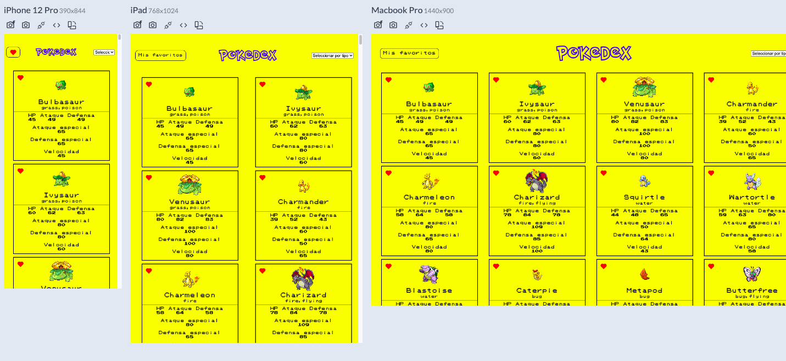

# Pokedex

A Pokedex consuming the PokeAPI service made entirely in Vanilla Javascript with no frameworks or boilerplates, created by [Alejo Vilches](https://www.linkedin.com/in/alejo-ezequiel-vilches-189b3277/).

## Demo

You can test the app clicking [this link](https://pokedex-alejovilches.netlify.app)!

## Features

- A loader to wait for the content from the API.
- Data from Pokemons is provided by the POKEApi service.
- You can save your favourite Pokemons in localStorage
- You can filter the Pokemons according to their type using the selection bar.

## Feedback

If you have any feedback, please reach out to us at alejoevilches@gmail.com or you can send me a message using [LinkedIn](https://www.linkedin.com/in/alejo-ezequiel-vilches-189b3277/)

## 🚀 About Me
I'm a front end developer based in Buenos Aires, Argentina, learning modern JavaScript. This app is my last project using Vanilla JavaScript. You'll see from now on projects using the React framework.

I'm also available to work and participate in web and software development.

